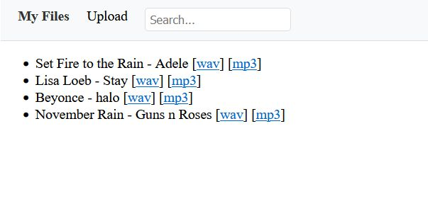

# Intro

An audio storage app.  

Features: 

* upload audio and video files; 
* all uploaded media automatically converted to wav/mp3;
* full text search over file names.

**Note: after submitting files to be uploaded, you need to wait until you can see them on page**

# How to run

Pull repository:

```bash
git clone git@github.com:aleksandrasd/audiostorage.git audiostorage
```

Build and run app

```bash
cd audiostorage
make build run
```

Open app on: http://127.0.0.1:8000/


Object storage (minio) browser: http://127.0.0.1:9001 (psw/user: minioadmin)


Postgres database: localhost:5432 (login: postgres, psw: mysecretpassword)


# Design


**Usecase: upload files**

1. User uploads file;
2. App uploads the file to object storage (Minio);
3. App "puts" job to convert files into Queue (Redis);
4. Worker "gets" a new job - downloads files from object storage, convert to mp3 and wav format, uploads files into object storage, changes job status in database (postgres)

**Usecase: search**

Full text search is implemented in postgres. I only customized tokenization.

I use TeamHide's fastapi boilerplate (see first commit).

# Entities

**Note: not all features that were planned to be implemented were implemented**


# Screenshots

Here is how a page looks after uploading audio:



**Note it takes time for audio to be converted.**.

Here is how a page looks when searching for keyword "Rain":


